<div align="center">

<!-- NURTURE HEADER SVG: scribble-draw animation, pastel sky + meadow -->


<!-- If header.svg isn't pushed yet, this fallback banner still conveys the vibe -->

</div>

---

<div align="center">

<!-- SCRIBBLE TITLE SVG — embed directly as a data URI image via GitHub's SVG support -->

<picture>
  
</picture>

<picture>
  
</picture>

</div>

---

<!-- ╔══════════════════════════════════════════════╗ -->
<!-- ║        NURTURE SCRIBBLE DIVIDER SVG          ║ -->
<!-- ╚══════════════════════════════════════════════╝ -->

<div align="center">

<svg viewBox="0 0 800 60" width="700" xmlns="http://www.w3.org/2000/svg">
  <style>
    .scribble-line {
      fill: none;
      stroke: #a8d8ea;
      stroke-width: 2.2;
      stroke-linecap: round;
      stroke-linejoin: round;
      stroke-dasharray: 900;
      stroke-dashoffset: 900;
      animation: draw-line 2.4s ease forwards;
    }
    .scribble-line2 {
      fill: none;
      stroke: #b8e0d2;
      stroke-width: 1.4;
      stroke-linecap: round;
      stroke-dasharray: 600;
      stroke-dashoffset: 600;
      animation: draw-line 2.8s 0.3s ease forwards;
    }
    .dot {
      fill: #d6c9e8;
      opacity: 0;
      animation: pop-in 0.4s ease forwards;
    }
    @keyframes draw-line {
      to { stroke-dashoffset: 0; }
    }
    @keyframes pop-in {
      0%   { opacity: 0; r: 0; }
      80%  { opacity: 1; r: 5; }
      100% { opacity: 0.7; r: 3.5; }
    }
  </style>
  <!-- main wavy scribble -->
  <path class="scribble-line"
    d="M10,35 C60,15 110,50 160,30 C210,10 250,45 310,32
       C360,20 410,48 460,28 C510,10 560,44 620,30
       C670,18 720,42 790,32" />
  <!-- secondary softer wave -->
  <path class="scribble-line2"
    d="M10,42 C70,55 130,28 200,40 C270,52 330,22 400,38
       C470,54 540,24 610,38 C680,52 740,30 790,40" />
  <!-- accent dots -->
  <circle class="dot" cx="160"  cy="30"  r="3.5" style="animation-delay:1.0s" />
  <circle class="dot" cx="310"  cy="32"  r="3.5" style="animation-delay:1.4s" />
  <circle class="dot" cx="460"  cy="28"  r="3.5" style="animation-delay:1.8s" />
  <circle class="dot" cx="620"  cy="30"  r="3.5" style="animation-delay:2.1s" />
</svg>

</div>

---

## &nbsp;について &nbsp;·&nbsp; about me

```
  名前  ///  Brent Abrazaldo
  場所  ///  Philippines 🇵🇭
  分野  ///  CS Student · Web Dev · Open Source
  今    ///  building things that feel alive
```

> *「何かを作り続けることに意味がある」*
> &nbsp;— *there is meaning in continuing to create something.*

---

## &nbsp;スキル &nbsp;·&nbsp; tools & tech

<div align="center">

<!-- Tech stack badges — muted Nurture palette tones -->


</div>

---

<!-- SCRIBBLE MEADOW DIVIDER SVG -->

<div align="center">

<svg viewBox="0 0 800 80" width="700" xmlns="http://www.w3.org/2000/svg">
  <style>
    .grass { fill: none; stroke: #b8e0d2; stroke-width: 1.8; stroke-linecap: round; opacity: 0; animation: grow-up 0.6s ease forwards; }
    .cloud { fill: #a8d8ea; opacity: 0; animation: float-in 1s ease forwards; }
    @keyframes grow-up {
      from { transform: scaleY(0); transform-origin: bottom; opacity: 0; }
      to   { transform: scaleY(1); transform-origin: bottom; opacity: 0.7; }
    }
    @keyframes float-in {
      from { opacity: 0; transform: translateY(6px); }
      to   { opacity: 0.18; transform: translateY(0); }
    }
  </style>
  <!-- soft cloud shapes -->
  <ellipse class="cloud" cx="120" cy="30" rx="60" ry="22" style="animation-delay:0.1s" />
  <ellipse class="cloud" cx="420" cy="22" rx="80" ry="18" style="animation-delay:0.3s" />
  <ellipse class="cloud" cx="680" cy="32" rx="55" ry="18" style="animation-delay:0.5s" />
  <!-- grass blades -->
  <line class="grass" x1="50"  y1="70" x2="48"  y2="50" style="animation-delay:0.2s" />
  <line class="grass" x1="55"  y1="70" x2="58"  y2="48" style="animation-delay:0.3s" />
  <line class="grass" x1="60"  y1="70" x2="62"  y2="52" style="animation-delay:0.4s" />
  <line class="grass" x1="200" y1="70" x2="198" y2="52" style="animation-delay:0.5s" />
  <line class="grass" x1="205" y1="70" x2="208" y2="49" style="animation-delay:0.6s" />
  <line class="grass" x1="350" y1="70" x2="348" y2="54" style="animation-delay:0.4s" />
  <line class="grass" x1="355" y1="70" x2="358" y2="50" style="animation-delay:0.5s" />
  <line class="grass" x1="500" y1="70" x2="498" y2="52" style="animation-delay:0.3s" />
  <line class="grass" x1="505" y1="70" x2="508" y2="48" style="animation-delay:0.4s" />
  <line class="grass" x1="650" y1="70" x2="648" y2="54" style="animation-delay:0.5s" />
  <line class="grass" x1="655" y1="70" x2="658" y2="50" style="animation-delay:0.6s" />
  <line class="grass" x1="740" y1="70" x2="738" y2="53" style="animation-delay:0.3s" />
  <line class="grass" x1="745" y1="70" x2="748" y2="49" style="animation-delay:0.4s" />
</svg>

</div>

---

## &nbsp;プロジェクト &nbsp;·&nbsp; featured work

<div align="center">

[](https://github.com/Brent001/kaido_backup)
&nbsp;&nbsp;
[](https://github.com/Brent001/Portfol.io)

[](https://github.com/Brent001/Kaguya_backup)
&nbsp;&nbsp;
[](https://github.com/Brent001/musify)

</div>

---

## &nbsp;統計 &nbsp;·&nbsp; stats

<div align="center">


&nbsp;


<br/>


</div>

---

<!-- SCRIBBLE FOOTER SVG — hand-drawn stars & dots -->

<div align="center">

<svg viewBox="0 0 800 50" width="700" xmlns="http://www.w3.org/2000/svg">
  <style>
    .star-line { fill: none; stroke: #d6c9e8; stroke-width: 1.5; stroke-linecap: round; stroke-dasharray: 40; stroke-dashoffset: 40; animation: draw-line 1.2s ease forwards; }
    .star-dot  { fill: #a8d8ea; opacity: 0; animation: twinkle 2s ease infinite; }
    @keyframes draw-line { to { stroke-dashoffset: 0; } }
    @keyframes twinkle {
      0%, 100% { opacity: 0.2; r: 2; }
      50%       { opacity: 0.9; r: 3.5; }
    }
  </style>
  <!-- scribble star left -->
  <line class="star-line" x1="80"  y1="15" x2="80"  y2="35" style="animation-delay:0.0s"/>
  <line class="star-line" x1="70"  y1="25" x2="90"  y2="25" style="animation-delay:0.1s"/>
  <line class="star-line" x1="73"  y1="18" x2="87"  y2="32" style="animation-delay:0.2s"/>
  <line class="star-line" x1="87"  y1="18" x2="73"  y2="32" style="animation-delay:0.3s"/>
  <!-- scribble star mid -->
  <line class="star-line" x1="400" y1="12" x2="400" y2="38" style="animation-delay:0.4s"/>
  <line class="star-line" x1="387" y1="25" x2="413" y2="25" style="animation-delay:0.5s"/>
  <line class="star-line" x1="391" y1="16" x2="409" y2="34" style="animation-delay:0.6s"/>
  <line class="star-line" x1="409" y1="16" x2="391" y2="34" style="animation-delay:0.7s"/>
  <!-- scribble star right -->
  <line class="star-line" x1="720" y1="15" x2="720" y2="35" style="animation-delay:0.3s"/>
  <line class="star-line" x1="710" y1="25" x2="730" y2="25" style="animation-delay:0.4s"/>
  <line class="star-line" x1="713" y1="18" x2="727" y2="32" style="animation-delay:0.5s"/>
  <line class="star-line" x1="727" y1="18" x2="713" y2="32" style="animation-delay:0.6s"/>
  <!-- twinkling dots scattered -->
  <circle class="star-dot" cx="160" cy="20" r="2.5" style="animation-delay:0.0s"/>
  <circle class="star-dot" cx="240" cy="35" r="2"   style="animation-delay:0.5s"/>
  <circle class="star-dot" cx="320" cy="15" r="3"   style="animation-delay:1.0s"/>
  <circle class="star-dot" cx="480" cy="38" r="2"   style="animation-delay:0.3s"/>
  <circle class="star-dot" cx="560" cy="12" r="2.5" style="animation-delay:0.8s"/>
  <circle class="star-dot" cx="640" cy="30" r="2"   style="animation-delay:0.2s"/>
</svg>

</div>

<div align="center">

*「空を見上げてみて」*&emsp;·&emsp;look at the sky

&nbsp;

[](https://github.com/Brent001)

</div>

---

<!-- ═══════════════════════════════════════════════════════════════
     SETUP NOTES — read before pushing
     ═══════════════════════════════════════════════════════════════

  1. REPO:  Create a public repo named exactly "Brent001" if it doesn't exist.
            Place this file as README.md at the root.

  2. OPTIONAL HEADER SVG (for the top banner):
     Create header.svg in the same repo with the scribble banner below.
     Reference it as:
       
     (GitHub serves SVGs from the same repo with animations intact.)

  3. FONTS: The typing SVG uses "Caveat" (Google Fonts handwriting).
            It renders via demolab's hosted service — no extra setup.

  4. STATS: github-readme-stats and streak-stats work without a token
            for public repos. If rate-limited, self-host or add a VERCEL_TOKEN.

  5. COLORS USED (Porter Robinson Nurture palette):
       Sky blue    #a8d8ea   — main accent
       Sage green  #b8e0d2   — secondary
       Lavender    #d6c9e8   — tertiary / stars
       Muted teal  #7BBFCC   — typing cursor / ring
       Dark base   #0d1117   — GitHub dark bg

═══════════════════════════════════════════════════════════════ -->
